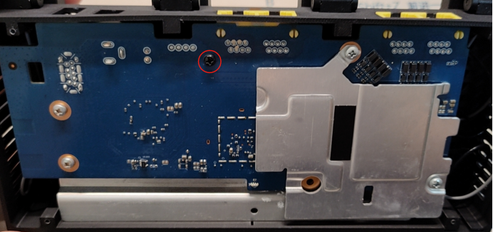
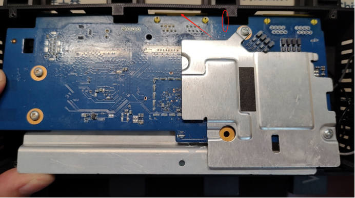
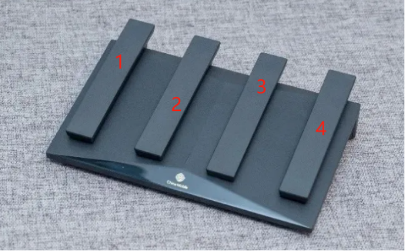
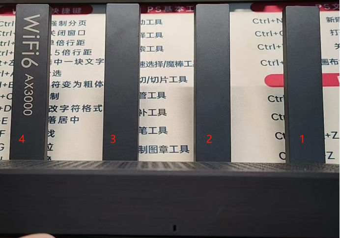
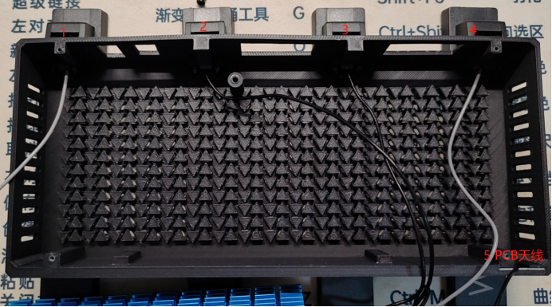
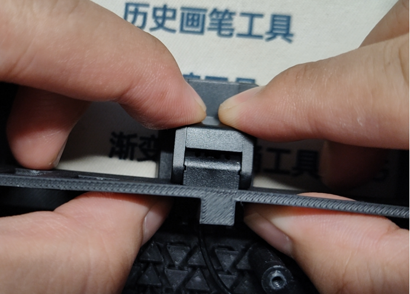
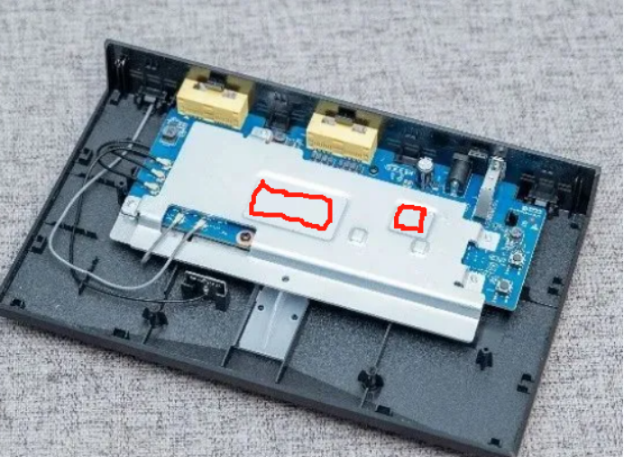
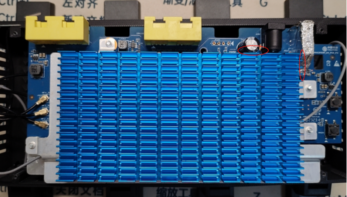

# **注意事项**

- 主板的大散热片朝上安装，小散热片朝下，螺丝孔位为下图圆圈位置，

螺丝使用原版外壳主板的固定螺丝

- 安装主板时要先将斜着拿PCB主板，然后圆圈处的PCB贴着支撑柱，

  再按箭头方向慢慢放入直至孔位对准，拆下同理

  

- 由于主板是在原版外壳的基础上反向了，所以天线的摆放位置也要反向

按反向放置，其中 1 4为2.4G天线 灰色线  2 3为5G天线  黑色线  1 2 3 4 号天线长度依次增加用以区分位置

- 外壳采用PLA 实心填充打印，PLA材料韧性比较弱，在安装天线时应该慢慢推挤进卡口！！！ 

  不可暴力猛推！！！按以下用力方式慢慢用力推入

- 如果需要安装120mm*64mm*6.3mm散热片 首先最好将2.4G天线接口安装上，

  不然安装散热片后2.4G天线接口只能通过镊子之类的东西安装了，其次需要先将导热

  硅胶垫（4mm厚度）粘在主板大散热片的凹槽处

​		再将散热片贴在下图所示位置，靠着USB口和圈内的电容放置，防止干涉

- 天线卡口最好不要多次拆装，尽量一次安装后不要拆下，卡口属于较容易损伤

  部分，谨慎处理！

  

- 螺丝不要因为想要更压紧然后一直拧入，因为螺丝都为自攻螺丝，在基本紧固

  后可以再稍微拧一点点即可。防止滑丝！